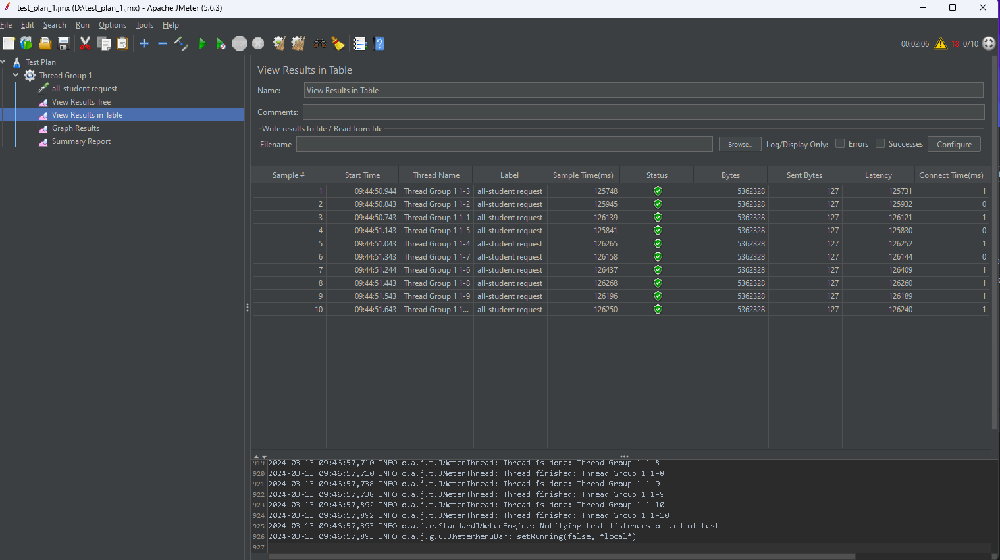
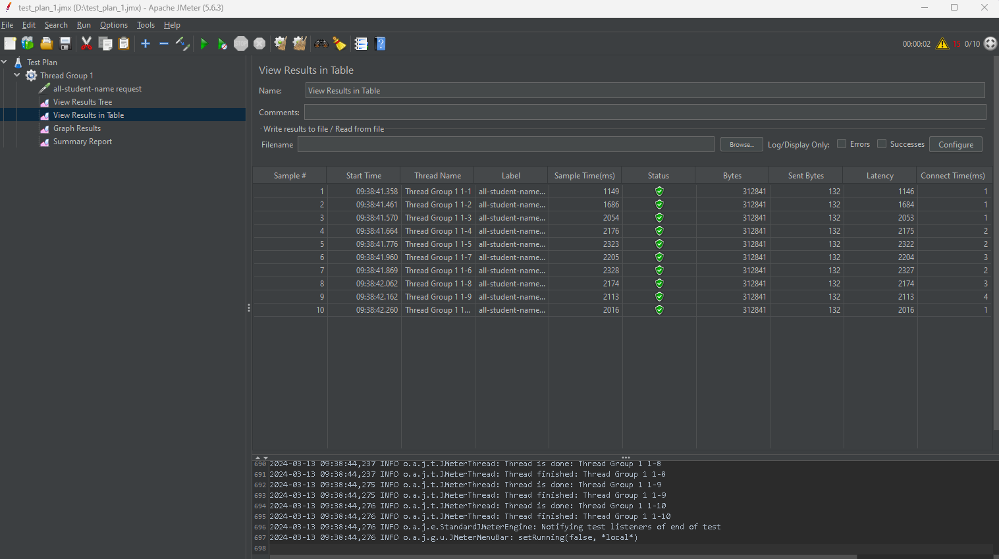
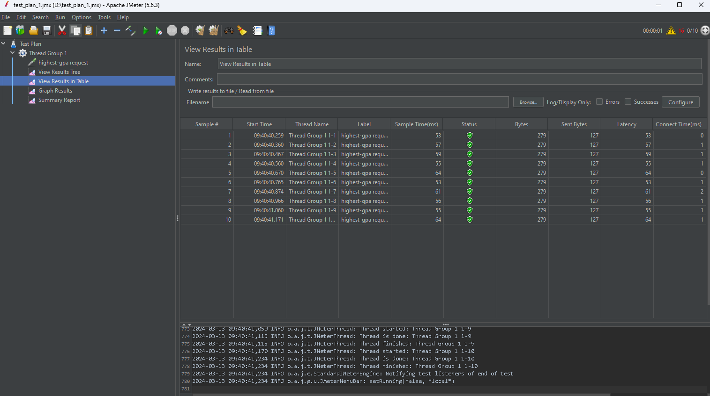
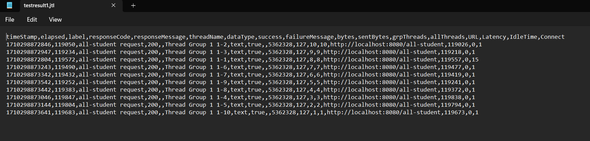
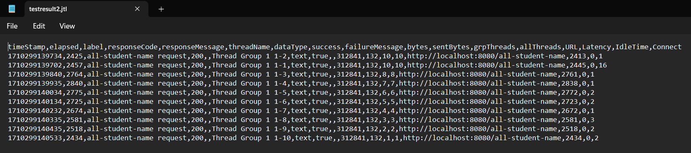
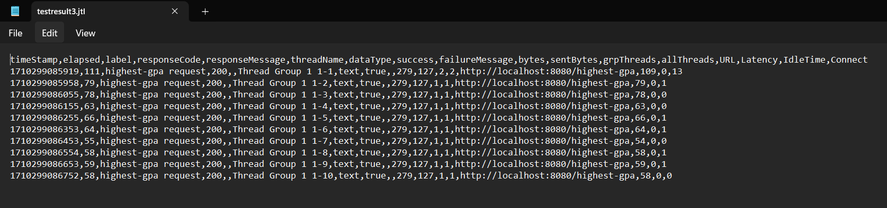
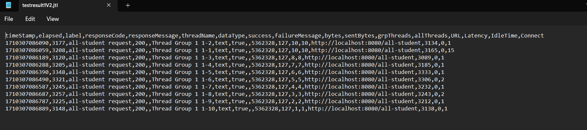
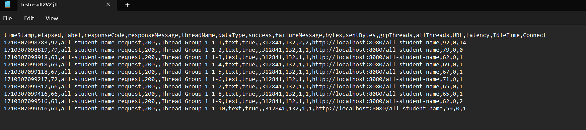
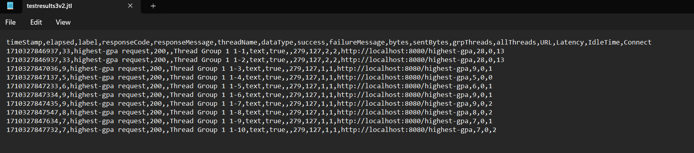

Sebelum profiling

hasil dari /all-student

hasil dari /all-student-name 

hasil dari /highest-gpa

hasil dari /all-student melalui CLI

hasil dari /all-student-name melalui CLI

hasil dari /highest-gpa melalui CLI

setelah profiling

hasil dari /all-student melalui CLI

hasil dari /all-student-name melalui CLI

hasil dari /highest-gpa melalui CLI

Dengan melakukan profiling maka kita akan dapat mengetahui mana method yang membuat program menjadi lama dieksekusi kita juga dapat tahu berapa lama waktu yang dibutuhkan agar method tersebut dapat selesai di eksekusi sehingga kita dapat melakukan perfomance optimization yang dapat mempercepat eksekusi kode kita. Hal ini terlihat pada test request `/all-student` yang pada awalnya berjalan selama 119050 ms, namun setelah dilakukan profiling dan optimize, test request `/all-student` dapat terselesaikan hanya dalam waktu 3177 ms. Selain itu pada test request `/all-student-name`, pada awalnya membutuhkan waktu eksekusi selama 24245 ms, namun setelah dilakukan profiling dan optimize, proses eksekusi test request `/all-student-name` hanya membutuhkan waktu selama 97 ms. Pada test yang ketiga, yaitu test request `/highest-gpa` pada awalnya membutuhkan waktu selama 111 ms untuk menyelesaikan proses eksekusi, namun setelah dilakukan profiling dan optimize, proses eksekusi test request `/highest-gpa` hanya membutuhkan waktu 33 ms saja. Jadi dengan melakukan optimisasi program maka akan berpengaruh kepada aplikasi.

## Refleksi
1. Pengujian kinerja dengan JMeter berfokus pada evaluasi kinerja keseluruhan aplikasi di bawah beban. JMeter digunakan terutama untuk pengujian beban, pengujian stres, dan pengujian kinerja aplikasi web, API, dan layanan. Jmeter mensimulasikan beberapa pengguna yang berinteraksi dengan aplikasi secara bersamaan untuk mengevaluasi kinerjanya di bawah beban yang berbeda. sementara itu profiler IntelliJ melakukan analisa runtime aplikasi, kinerja aplikasi, dan eksekusi kode untuk menemukan area spesifik yang perlu dioptimalkan. IntelliJ Profiler membantu mengidentifikasi area kode yang menggunakan sumber daya paling banyak, seperti waktu CPU atau memori, dan mungkin menyebabkan masalah kinerja.

2. Profiling melakukan analisis runtime aplikasi, kinerja aplikasi, dan eksekusi kode untuk menemukan area spesifik yang perlu dioptimalkan. Nantinya profiling akan dapat memberitahu bagaimana kode kita berjalan dan bagian mana dari program yang memakan waktu paling lama untuk di eksekusi. Dengan mengetahui hal ini, nantinya kita dapat mengoptimalkan kode kita, sehingga aplikasi akan dapat berjalan lebih baik daripada sebelumnya.

3. Ya, IntelliJ profiler membantu saya untuk dapat mencari kelemahan pada aplikasi saya dan memberitahu bagian mana dari aplikasi saya yang memakan waktu eksekusi paling lama, sehingga dengan pemberitahuan ini saya dapat melakukan optimisasi sehingga aplikasi saya dapat berjalan dengan lebih baik daripada sebelumnya.

4. Tantangan yang dihadapi adalah memahami hasil dari profiling, dikarenakan ini adalah pengalaman pertama saya dalam menggunakan profiling sehingga saya agak sedikit kesulitan untuk memahami output dari profiling, selain itu dikarenakan ini juga adalah pengalaman pertama saya dalam menggunakan JMeter jadi saya juga sedikit kesulitan dalam membaca hasil output dari JMeter. Cara saya menghadapi masalah ini adalah dengan banyak membaca dokumentasi profiling dan JMeter sehingga saya dapat memahami output-output yang dihasilkan dari JMeter dan profiling.

5. IntelliJ Profiler cukup mudah digunakan karena dia berada di lingkup IntelliJ sehingga kita bisa melakukan profiling sambil menulis kode, selain itu IntelliJ profiler dapat memberitahukan mengenai kelemahan dari aplikasi saya dan menunjukkan bagian dari aplikasi saya yang berpotensi membuat aplikasi saya berjalan lambat, dengan adanya pemberitahuan ini, maka saya dapat menentukan bagian mana yang harus saya optimisasi dan bagian mana yang tidak harus dioptimasi, dengan melakukan hal ini maka aplikasi saya dapat berjalan dengan lebih baik daripada sebelumnya.

6. Selama melakukan tutorial ini, saya belum menemukan kasus seperti yang disebutkan dalam soal, tetapi jika saya menemukan masalah tersebut maka saya akan melakukan lakukan uji ulang dengan konfigurasi yang serupa untuk memverifikasi hasil dari kedua alat tersebut. Uji ulang dapat membantu memvalidasi temuan dan memastikan konsistensi antara hasil dari IntelliJ Profiler dan JMeter. Jika hasil masih tidak konsisten juga maka saya akan melakukan analisis terhadap hasil output dari JMeter dan profiling untuk dapat memahami penyebab perbedaan tersebut. Selain itu kemungkinan perbedaan tersebut juga bisa saja terjadi dikarenakan fokus profiling dengan JMeter yang berbeda, dimana JMeter berfokus kepada pada evaluasi kinerja keseluruhan aplikasi di bawah beban. Sedangkan profiling berfokus kepada analisa runtime aplikasi, kinerja aplikasi, dan eksekusi kode untuk menemukan area spesifik yang perlu dioptimalkan.

7. Strategi saya adalah dengan melihat output durasi dari Jmeter, setelah itu melakukan profiling untuk mencari tahu kode mana yang dapat dioptimalkan, setelah itu saya akan mencoba untuk mengoptimalkan kode tersebut. Setelah itu, saya akan melakukan test JMeter lagi untuk membandingkan apakah kode optimisasi saya sudah berjalan lebih cepat dariada kode awal saya. Untuk memastikan kode saya dapat memiliki output yang tepat maka perlu dibuat sebuah unit test sehingga kita dapat memastikan bahwa fungsionalitas dari kode yang telah kita buat masih dapat berjalan sesuai dengan keinginan kita.